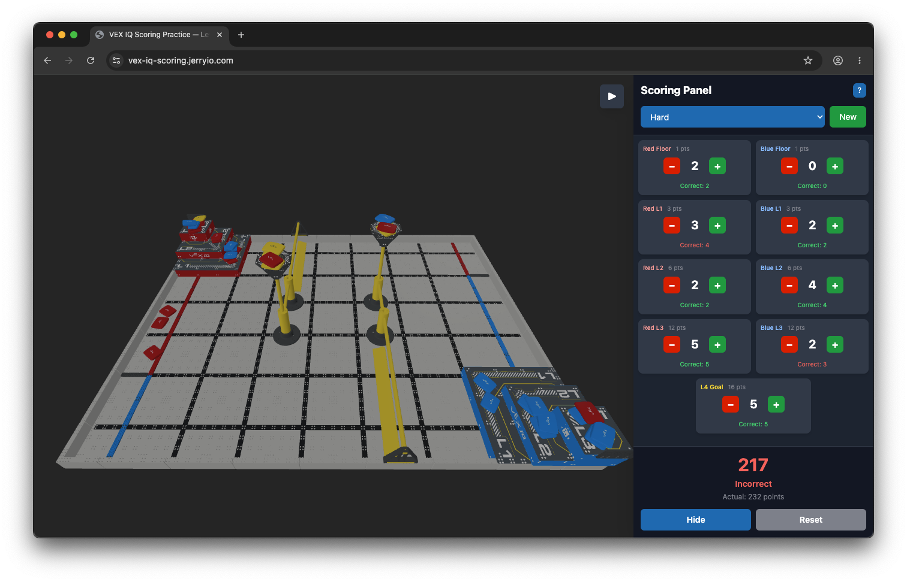

# VEX IQ Scoring Practice — Level Up

An interactive 3D web application for practicing [VIQRC Level Up](https://content.vexrobotics.com/docs/2026-2027/level-up/files/viqrc-level-up-0.1.2.pdf) (2026–2027) scoring. Count scored bean bags across pyramid goals, floor goals, and L4 goals, then check your total against the correct answer.

This project simplifies some edge cases for learning, but works well as a starting point for new scorekeeper referees and students learning the Level Up scoring system.

**Available at:** [vex-iq-scoring.jerryio.com](https://vex-iq-scoring.jerryio.com)



## How to Play

1. Select a difficulty level and click **New** to generate a random scenario.
2. Examine the 3D field and count **scored bean bags** for each goal tier using the panel on the right.
3. Use **−** and **+** to enter your counts. The panel shows your running point total.
4. Click **Check** to verify your answer and see the correct counts per goal.

### Scoring (2026–2027 Level Up)

| Goal  | Points per scored bean bag |
| ----- | -------------------------- |
| Floor | 1                          |
| L1    | 3                          |
| L2    | 6                          |
| L3    | 12                         |
| L4    | 16                         |

In red and blue goals, **red/blue and yellow** bean bags can score. On the **L4 goal**, only **yellow** bean bags score.

### Scoring Panel

The panel tracks scored bean bags for:

- **Red Floor** and **Blue Floor**
- **Red/Blue L1, L2, and L3** (pyramid goals)
- **L4 Goal** (centered row)

Your total score is calculated automatically from the counts above.

## Difficulty Levels

### Easy

- Simple goal configurations
- Fewer bean bags per goal
- Floor goals may be empty or hold a single bean bag

### Medium

- More varied pyramid stacks
- Floor goals with multiple bean bags across stack positions

### Hard

- Mixed-color stacks (distractor bean bags that do not score)
- Invalid floor placements (bean bags that do not count as scored)
- More complex L4 configurations

## Scope & Limitations

This practice app focuses on **goal scoring** only. It does **not** currently include:

- Load zones or bean bags introduced during the match
- Preloads or bean bags remaining elsewhere on the field
- Robot contact rules (SC1–SC5 assume bean bags are not touching robots)

For the official scoring rules, see the [VIQRC Level Up Game Manual](https://content.vexrobotics.com/docs/2026-2027/level-up/files/viqrc-level-up-0.1.2.pdf).

## Getting Started

### Prerequisites

- [Bun](https://bun.sh) v1.0 or higher

### Installation

```bash
# Install dependencies
bun install
```

### Development

```bash
# Start development server
bun run dev
```

Visit `http://localhost:5173` to see the application.

### Build

```bash
# Build for production
bun run build

# Preview production build
bun run preview
```

### Deploy

```bash
bun run deploy
```

### Code Formatting

```bash
# Format code with Prettier
bun run format
```

## Keyboard & Mouse Controls

### 3D Viewport

- **Left Click + Drag**: Rotate camera
- **Right Click + Drag**: Pan camera
- **Scroll Wheel**: Zoom in/out
- **Touch**: Pinch to zoom, drag to rotate

### Scoring Panel

- **Desktop**: Click arrow button on the left to collapse/expand
- **Mobile**: Tap the floating menu button to open the panel

## Browser Support

- Chrome/Edge 90+
- Firefox 88+
- Safari 14+
- Mobile browsers with WebGL support

## Contributing

This is a practice/educational project. Feel free to fork and modify for your own use.

## License

This project is licensed under the GNU General Public License v3.0 (GPLv3). See the [LICENSE](LICENSE) file for details.

VEX IQ is a trademark of Innovation First International, Inc. This project is for educational purposes.
